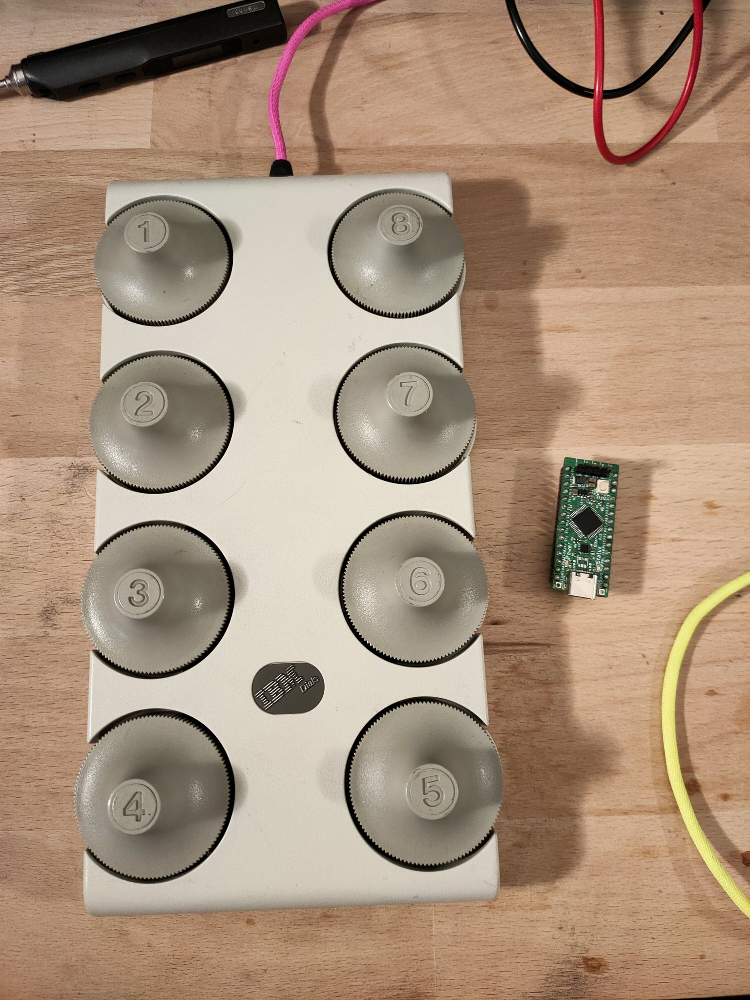

# IBM-dials-retrofit

This repo contains the firmware and hardware instructions to retrofit your *IBM Dials* with a full-speed USB interface, cabable of CDC, MIDI and HID. The mod uses an OtterPill, a STM32F072 devboard featuring USB-PD. This feature however is not needed and the PD-phy should be replaced with two 5.1k-ohm resistors. Additionally an IBM Dials and a 3D printed Otter-Pill mount is needed.

The firmware on the OtterPill can be customized and used for a variety of applications, e.g. [KiCAD](https://twitter.com/JanHenrikH/status/1245113168621449217).

**Documentation is WIP**

## Building instructions  STILL WIP

Materials needed:
 - IBM Dials
 - OtterPill
 - 3D printed holder
 - some wires

#### 1 - Prepare your OtterPill

Remove the FUSB302 and add two 5.1k ohm resistos to R1 and R2. Slide the board into the 3D printed part and secure with some glue if needed. Add two wires to DFU and 3.3V (break out the DFU-Button so you can boot into DFU-mode while the case is closed).

#### 2 - Prepare the IBM Dials

Open up the case and unscrew the old connector. Remove C5 and lift the board center facing side of R3.

#### 3 - Install OtterPill

Fix the OtterPill where you have unscrewed the connector, reuse the screws.

#### 4 - Wiring 1

Wire the dials from the old ADC to the ADC-inputs of the OtterPill (PA1-PA7, PB0), connect the exposed pad from R3 to 3.3V from the OtterPill and connect 5V to the center of L1. Additionally one can add 10nF capacitors to the ADC inputs to stabilize the readings.

#### 5 - Wiring 2

Add a large (~100µF) capacitor to 3.3V and connect OtterPills ground as shown in the following picture.

#### 6 - Flashing

To flash your newly retrofitted IBM Dials short the cables connected to DFU/3.3V and plug in the USB. OtterPill will boot into DFU bootloader mode, flash it with `dfu-util -a 0 -s 0x08000000:leave -D build/midi-dials.bin`. Before you close the case, run the cable through the back so that you can always reach it.
